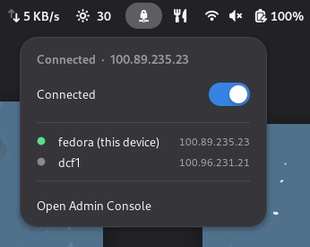
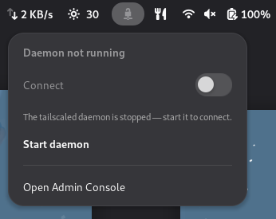

# Tailscale Toggle

A minimal GNOME Shell extension that puts a **Tailscale** button in the top
panel — connection status at a glance, one-click connect/disconnect, and the
full list of devices on your tailnet.

| Connected | Daemon stopped |
|:---:|:---:|
|  |  |


## Features

- **Panel icon** that shows connection state (bright when connected, dimmed when off).
- **Toggle switch** to connect or disconnect Tailscale.
- **Device list** of this machine plus every peer, each with an online dot and
  its Tailscale IP. Click a device to copy its IP to the clipboard.
- **Daemon button** that appears next to the hint while disconnected, to start
  or stop `tailscaled` from the menu (the one action that asks for a password).
- **Clear hints** when something needs setting up (daemon stopped, operator not
  configured, not logged in).

## Requirements

- GNOME Shell 45–48
- [`tailscale`](https://tailscale.com/download) installed (CLI + `tailscaled`)

## Install

### From source

```sh
git clone https://github.com/gnshb/gnome-tailscale-toggle.git \
  ~/.local/share/gnome-shell/extensions/tailscale-toggle@gnshb
gnome-extensions enable tailscale-toggle@gnshb
```

### One-time setup (required)

Run these once:

```sh
# keep the daemon running (idle cost is negligible — ~tens of MB RAM, ~0 CPU)
sudo systemctl enable --now tailscaled
# let your user control Tailscale without root
sudo tailscale set --operator=$USER
```

With those done, the extension controls Tailscale as your normal user.

## How it works

- **Status** — read from `tailscale status --json`; refreshed on load, when you
  open the menu, and after a toggle, so the menu is always current when you look
  at it.
- **Connect / disconnect** — runs `tailscale up` / `tailscale down`.
- **Daemon button** — runs `pkexec systemctl start|stop tailscaled` (a systemd
  service action, so it needs root once). Shown only while disconnected.
